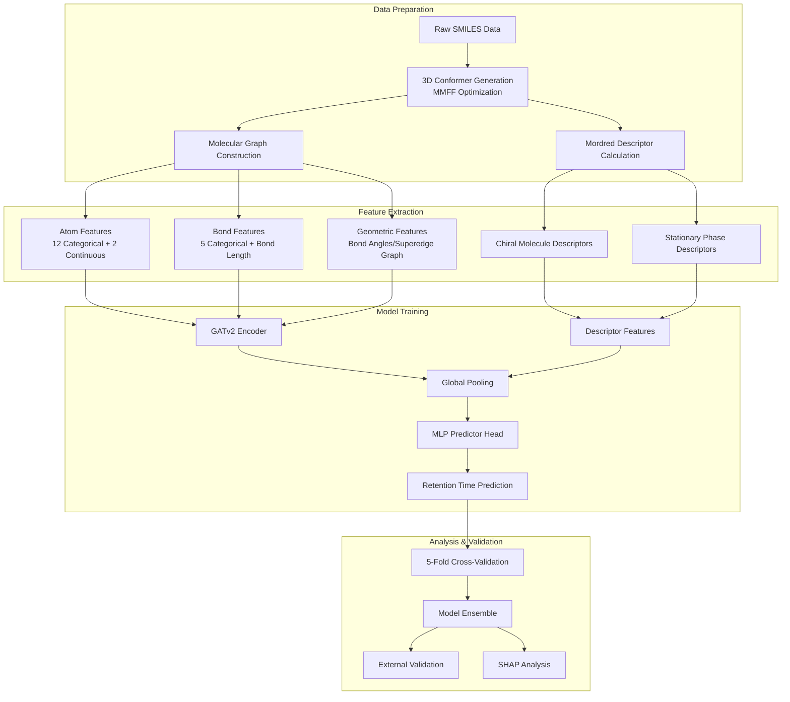

# Graph Attention Network for Chromatographic Retention Time Prediction of Chiral Molecules

[](https://opensource.org/licenses/MIT)
[](https://www.python.org/)
[](https://pytorch.org/)
[](https://www.rdkit.org/)

This project implements a **Graph Attention Network (GAT)**-based deep learning approach for predicting the retention time (RT) of chiral molecules in gas chromatography (GC). By representing molecules as graph structures and integrating three-dimensional geometric features with molecular descriptors, our method enables accurate modeling of chiral separation behavior.

---

## Table of Contents

- [Background](#background)
- [Key Features and Innovations](#key-features-and-innovations)
- [System Architecture](#system-architecture)
- [Installation](#installation)
- [Dataset Description](#dataset-description)
- [Usage Guide](#usage-guide)
- [Core Modules](#core-modules)
- [Model Architecture](#model-architecture)
- [Results Visualization](#results-visualization)
- [Project Structure](#project-structure)
- [Development Roadmap](#development-roadmap)
- [Dependencies](#dependencies)
- [License](#license)
- [Citation](#citation)

---

## Background

Chiral enantiomer separation is a critical challenge in pharmaceutical chemistry, natural product research, and materials science. Traditional GC retention time prediction relies on empirical formulas or simple Quantitative Structure-Activity Relationship (QSAR) models, which struggle to capture the complex stereochemical interactions between chiral molecules and chiral stationary phases.

This project proposes an innovative graph neural network approach that models molecules as atom-bond graphs while integrating **three-dimensional geometric features**, **chiral center characteristics**, and **chromatographic column stationary phase features** to achieve high-precision retention time prediction.

---

## Key Features and Innovations

### 🔬 Molecular Representation Innovations

1. **Graph-Based Molecular Representation**: Molecules are abstracted as graphs where atoms serve as nodes and chemical bonds as edges
2. **3D Geometric Feature Integration**:
   - MMFF force field optimization for 3D conformer generation
   - Bond length extraction as edge features
   - Bond angle calculation with superedge graph construction
3. **Chiral Feature Encoding**: Explicit encoding of atomic chiral tags (R/S configuration), chiral center counts, and other stereochemical information
4. **Dual-Molecule Feature Fusion**: Simultaneous consideration of both analyte chiral molecules and column stationary phase molecular descriptors

### 🧠 Model Architecture Innovations

1. **GATv2 Dynamic Attention Mechanism**: Employs GATv2Conv for dynamic attention computation, enabling the model to learn the importance of inter-atomic interactions
2. **Residual Connections with Batch Normalization**: Enhanced stability for deep network training
3. **MLP Predictor Head**: Multi-layer perceptron replaces simple linear layers for improved regression performance
4. **Ensemble Learning Strategy**: 5-fold cross-validation training with model ensemble for enhanced generalization

### 📊 Feature Engineering Innovations

1. **Mordred Descriptor Calculation**: Computes 1800+ molecular descriptors including 2D and 3D features
2. **SHAP Feature Importance Analysis**: Multi-criteria feature selection based on SHAP values
3. **Dynamic Feature Selection**: Automatic selection of the most relevant feature subsets for different column types

### ⚙️ Training Optimization Strategies

1. **Bayesian Hyperparameter Optimization**: Automatic search for optimal learning rate, network depth, attention heads, etc.
2. **Stratified Cross-Validation**: Stratification based on retention time distribution ensures balanced data splits
3. **Early Stopping and Learning Rate Scheduling**: Prevents overfitting and accelerates convergence
4. **Data Augmentation**: Supports node feature perturbation and label smoothing

---

## System Architecture



---

## Installation

### System Requirements

- Python 3.8+
- CUDA 11.8+ (optional, for GPU acceleration)
- 16GB+ RAM

### Installation Steps

1. **Clone the Repository**

```bash
git clone https://github.com/Weeqe1/Enantioseparation.git
cd Enantioseparation
```

2. **Create Virtual Environment (Recommended)**

```bash
conda create -n enantio python=3.10
conda activate enantio
```

3. **Install Dependencies**

```bash
pip install -r requirements.txt
```

4. **Install PyTorch Geometric (Select Based on CUDA Version)**

```bash
# For CUDA 12.6
pip install torch-scatter torch-sparse torch-cluster torch-geometric -f https://data.pyg.org/whl/torch-2.6.0+cu126.html
```

---

## Dataset Description

### Input Data Format

The dataset should be in CSV format, stored at `dataset/data.csv`, containing the following columns:

| Column Name | Description | Example |
|-------------|-------------|---------|
| `Chiral_molecules_smile` | SMILES of chiral molecule | `C[C@H](O)CC` |
| `Column` | Chromatographic column type | `Cyclosil_B` |
| `RT` | Retention time (minutes) | `12.5` |
| Columns 4-18 | GC temperature program parameters | Numeric values |

### Supported Column Types

| Column Name | Stationary Phase Type |
|-------------|----------------------|
| `Cyclosil_B` | Cyclodextrin derivative |
| `Cyclodex_B` | β-Cyclodextrin |
| `HP_chiral_20β` | Chiral β-Cyclodextrin |
| `CP_Cyclodextrin_β_2,3,6_M_19` | Methylated β-Cyclodextrin |
| `CP_Chirasil_D_Val` | D-Valine chiral stationary phase |
| `CP_Chirasil_L_Val` | L-Valine chiral stationary phase |
| `CP_Chirasil_Dex_CB` | Chiral cyclodextrin composite phase |

---

## Usage Guide

### Configuration File

Set the execution mode and target parameters in `config.py`:

```python
# Execution mode: 'Dataset_construct' | 'Train' | 'Validate_External'
DESK = 'Train'

# Target chromatographic column
TRANSFER_TARGET = 'Cyclosil_B'

# Model selection (for baseline models only)
MODEL_NAME = 'GAT model'

# Random seed for reproducibility
RANDOM_SEED = 42
```

### Workflow

#### 1️⃣ Dataset Construction

```bash
# Set DESK = 'Dataset_construct'
python setup_base.py   # Baseline model data
python setup_GAT.py    # GAT model data
```

This step will:
- Generate MMFF-optimized 3D molecular structures
- Calculate Mordred molecular descriptors
- Construct PyTorch Geometric format graph data

#### 2️⃣ Model Training

```bash
# Set DESK = 'Train'
# Baseline model training (optional)
python setup_base.py

# GAT model training (primary)
python setup_GAT.py
```

The training process includes:
- 5-fold stratified cross-validation
- Automatic early stopping mechanism
- Model checkpoint saving
- TensorBoard logging

#### 3️⃣ SHAP Feature Analysis

```bash
python run_shap_analysis.py
```

Analysis outputs:
- Feature importance ranking
- SHAP summary plots
- Feature selection results

#### 4️⃣ Bayesian Hyperparameter Optimization

```bash
python paremeter_tuning_bayes.py
```

Optimized hyperparameters:
- Learning rate, batch size
- Number of layers, hidden dimensions
- Attention heads, dropout rate

#### 5️⃣ External Validation

```bash
# Set DESK = 'Validate_External'
python setup_GAT.py
```

---

## Core Modules

### Feature_calculation Module

**Location**: `Feature_calculation/Feature_calculation.py`

| Class/Function | Description |
|----------------|-------------|
| `CompoundKit` | Molecular feature vocabulary management; extracts categorical and continuous atom/bond features |
| `Compound3DKit` | 3D structure processing including MMFF optimization, bond length/angle calculations |
| `mol_to_geognn_graph_data_MMFF3d()` | Complete molecule-to-geometric-graph-data conversion pipeline |
| `calculate_descriptors()` | SHAP-selected Mordred descriptor calculation |
| `Construct_dataset()` | Constructs PyTorch Geometric Data objects |

**Atom Features (14 dimensions)**:

| Feature | Description | Dimension |
|---------|-------------|-----------|
| `atomic_num` | Atomic number | 1-118 + misc |
| `chiral_tag` | Chiral tag | R/S/unspecified/... |
| `degree` | Number of bonds | 0-10 + misc |
| `hybridization` | Hybridization type | sp/sp²/sp³/... |
| `is_aromatic` | Aromaticity | 0/1 |
| `formal_charge` | Formal charge | -5 to +10 |
| `mass` | Atomic mass | Continuous |
| `van_der_waals_radis` | Van der Waals radius | Continuous |
| ... | ... | ... |

**Bond Features (6 dimensions)**:

| Feature | Description |
|---------|-------------|
| `bond_type` | Single/Double/Triple/Aromatic |
| `bond_stereo` | Stereochemistry (E/Z, etc.) |
| `is_conjugated` | Conjugation status |
| `is_in_ring` | Ring membership |
| `bond_dir` | Bond direction |
| `bond_length` | Bond length (Å) |

### GAT_model Module

**Location**: `GAT_model/GAT_model.py`

```python
class GAT(torch.nn.Module):
    """
    GATv2 Graph Attention Network
    
    Architecture Features:
    - Multi-layer GATv2Conv (dynamic attention)
    - Residual connections + Batch normalization
    - Global mean pooling
    - MLP predictor head
    """
```

**Hyperparameter Description**:

| Parameter | Default | Description |
|-----------|---------|-------------|
| `hidden_dim` | 64 | Hidden layer dimension |
| `output_dim` | 64 | GAT output dimension |
| `heads` | 4 | Number of attention heads |
| `num_layers` | 3 | Number of GAT layers |
| `dropout` | 0.2 | Dropout rate |

### Baseline_model Module

**Location**: `Baseline_model/baseline_models.py`

Provides multiple baseline models for performance comparison:

| Model | Type | Characteristics |
|-------|------|-----------------|
| `Linear_Regression` | Linear | Baseline reference model |
| `Support_Vector_Regression` | Kernel Method | RBF kernel, suitable for non-linear patterns |
| `Gradient_Boosting_Regressor` | Ensemble | Gradient boosting with early stopping regularization |
| `Neural_Network_Regressor` | Deep Learning | 3-layer MLP with adaptive learning rate |
| `RandomForest` | Ensemble | 200 trees with bootstrap sampling |
| `Transformer` | Deep Learning | Self-attention mechanism |

### run_shap_analysis Module

**Location**: `run_shap_analysis.py`

Implements SHAP-based feature analysis and selection:

1. **SHAP Value Calculation**: Uses XGBoost surrogate model to compute feature SHAP values
2. **Multi-Criteria Feature Selection**:
   - Elbow method for importance threshold determination
   - Minimum absolute importance filtering
   - Domain keyword filtering
3. **Visualization Outputs**:
   - Feature importance curves
   - SHAP summary beeswarm plots
   - Feature correlation heatmaps

---

## Model Architecture

### GAT Model Forward Propagation Flow

```
Input: Molecular Graph G = (V, E)
       V: Atom nodes [N, F_node]
       E: Chemical bond edges [M, F_edge]

┌─────────────────────────────────────────┐
│           GATv2Conv Layer 1             │
│  x' = Σ α_ij · W·x_j                    │
│  α_ij = softmax(LeakyReLU(a·[Wx_i||Wx_j]))│
├─────────────────────────────────────────┤
│  Batch Normalization                    │
├─────────────────────────────────────────┤
│  ELU Activation + Dropout               │
├─────────────────────────────────────────┤
│  Residual Connection                    │
└─────────────────────────────────────────┘
              ×(num_layers - 1)
                    ↓
┌─────────────────────────────────────────┐
│  Global Mean Pooling                    │
│  h_G = (1/|V|) Σ h_i                    │
└─────────────────────────────────────────┘
                    ↓
┌─────────────────────────────────────────┐
│  MLP Predictor Head                     │
│  Linear(64) → ReLU → Dropout            │
│  Linear(32) → ReLU → Dropout            │
│  Linear(1) → Output                     │
└─────────────────────────────────────────┘
                    ↓
Output: Predicted Retention Time ŷ ∈ ℝ
```

---

## Results Visualization

Upon training completion, results are saved to the `Output/` directory:

### Output File Structure

```
Output/
├── GAT_model/
│   └── {TRANSFER_TARGET}/
│       ├── pics/
│       │   ├── {TRANSFER_TARGET}_predictions_1.png     # Fold 1 prediction scatter
│       │   ├── {TRANSFER_TARGET}_Error_1.png           # Fold 1 error distribution
│       │   └── {TRANSFER_TARGET}_predictions_ensemble.png  # Ensemble results
│       ├── dataset/
│       │   ├── dataset_{TRANSFER_TARGET}_orderly.npy
│       │   └── dataset_{TRANSFER_TARGET}_orderly_descriptors.npy
│       └── train_log/
│           └── training_log.txt                        # Training logs
├── Baseline/
│   └── {TRANSFER_TARGET}/
│       ├── models_evaluation.csv                       # Baseline model evaluation
│       └── pics/                                       # Model prediction plots
├── SHAP_Results/
│   ├── comparison_of_selected_features.csv             # Selected feature list
│   ├── feature_importance_curve_{COLUMN}.png
│   └── shap_summary_{COLUMN}.png
└── Parameter_tuning_bayes/
    └── checkpoint_{TRANSFER_TARGET}.json               # Optimization checkpoints
```

### Evaluation Metrics

| Metric | Formula | Description |
|--------|---------|-------------|
| **MAE** | $\frac{1}{n}\sum\|y_i - \hat{y}_i\|$ | Mean Absolute Error |
| **RMSE** | $\sqrt{\frac{1}{n}\sum(y_i - \hat{y}_i)^2}$ | Root Mean Squared Error |
| **R²** | $1 - \frac{\sum(y_i - \hat{y}_i)^2}{\sum(y_i - \bar{y})^2}$ | Coefficient of Determination |

---

## Project Structure

```
Enantioseparation/
│
├── 📂 Baseline_model/               # Baseline model module
│   ├── __init__.py
│   └── baseline_models.py           # 6 baseline regression model implementations
│
├── 📂 Feature_calculation/          # Feature calculation module
│   ├── __init__.py
│   ├── Feature_calculation.py       # Core feature extraction classes
│   └── id_names.py                  # Feature name definitions
│
├── 📂 GAT_model/                    # GAT model module
│   ├── __init__.py
│   ├── GAT_model.py                 # GATv2 network architecture
│   └── parse_args.py                # Command-line argument parsing
│
├── 📂 train/                        # Training utilities module
│   ├── __init__.py
│   ├── train.py                     # Training/evaluation functions
│   └── plot.py                      # Visualization functions
│
├── 📂 Validate_External/            # External validation module
│   ├── __init__.py
│   └── Validate_External.py
│
├── 📂 dataset/                      # Data directory
│   └── data.csv                     # Main dataset
│
├── 📂 Output/                       # Output directory (auto-generated)
├── 📂 saves/                        # Model checkpoint directory
│
├── 📜 config.py                     # Global configuration
├── 📜 setup_base.py                 # Baseline model entry point
├── 📜 setup_GAT.py                  # GAT model entry point
├── 📜 run_shap_analysis.py          # SHAP analysis script
├── 📜 paremeter_tuning_bayes.py     # Bayesian optimization script
├── 📜 requirements.txt              # Python dependencies
└── 📜 LICENSE                       # Open source license
```

---

## Dependencies

### Core Dependencies

```txt
pandas~=2.2.1
torch~=2.6.0+cu126
torch-geometric~=2.6.1
numpy~=1.26.4
scikit-learn~=1.6.1
rdkit~=2024.9.5
mordred~=1.2.0
```

### Analysis & Visualization

```txt
matplotlib~=3.10.0
seaborn~=0.13.2
shap~=0.48.0
xgboost~=3.0.2
```

### Optimization & Utilities

```txt
bayesian-optimization~=2.0.3
joblib~=1.4.2
tqdm~=4.67.1
cupy~=13.4.1
```

---

## License

This project is licensed under the **MIT License**.

See the [LICENSE](LICENSE) file for details.

---

## Citation

If you use this project in your research, please cite:

```bibtex
@software{enantioseparation2024,
  author = {Weeqe1},
  title = {Graph Attention Network for Chromatographic Retention Time Prediction of Chiral Molecules},
  year = {2024},
  url = {https://github.com/Weeqe1/Enantioseparation},
  version = {1.0.0}
}
```

---

## Contact

- **GitHub Issues**: Bug reports and feature requests are welcome via [Issues](https://github.com/Weeqe1/Enantioseparation/issues)
- **Pull Requests**: Code contributions and improvements are welcome

---

<p align="center">
  <i>⚗️ Bridging Molecular Chemistry and Graph Neural Networks for Intelligent Chiral Separation ⚗️</i>
</p>
